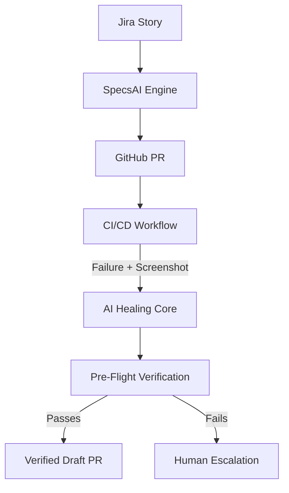

# 🚀 SpecsAI (SyncFlow)
### The World's First Autonomous Zero-Touch SDLC & Self-Healing QA Engine.

**SpecsAI** (SyncFlow) is an advanced AI-driven platform that bridges the gap between Product Requirements and Production-Ready Code. It transforms the traditionally manual SDLC into a fully autonomous, self-correcting loop using **Google Gemini 2.5 Flash** and the **Model Context Protocol (MCP)**.

---

## 🌟 Key Pillars

### 1. 🤖 Autonomous SDLC Sync
*   **Jira Webhooks**: Automatically listen for "Ready for QA" status and generate specs.
*   **GitHub Committer**: Autonomously branch, commit, and open PRs for generated test suites.
*   **TestRail Integration**: Automatically initialize manual test logs for compliance.

### 2. 🛡️ CI/CD Self-Healing Core
*   **Visual Multi-Modal Diagnosis**: Unlike standard log-based healing, SpecsAI uses **Vision AI** to analyze failure screenshots. It "sees" UI discrepancies, overlapping elements, and layout shifts to provide high-fidelity patches.
*   **Secure PR Pattern (HITL)**: Enterprise-safe architecture. The AI never pushes directly to production branches. Instead, it creates a dedicated fix branch and opens a **Verified Draft Pull Request** with a full root-cause analysis for human review.
*   **Pre-Flight Verification**: Every autonomous fix is automatically re-validated in the CI container. A PR is only generated if the test passes after the AI's patch.

### 3. 🔌 MCP Intelligence
*   **IDE Integration**: A standalone MCP server that brings Staff-level QA intelligence directly into your local IDE (Cursor/VS Code).
*   **Local Execution**: Run, debug, and heal tests locally before they ever reach the cloud.

---

## 🛠️ Technology Stack
*   **Core**: Next.js 15, TypeScript, TailwindCSS
*   **AI Engine**: Google Gemini 2.5 Flash
*   **Protocols**: Model Context Protocol (MCP)
*   **Integrations**: GitHub Octokit, Jira REST API, Playwright, Selenium

---

## 🚀 Quick Start

### 1. Configure Environment
Create a `.env.local` file with the following:
```bash
GOOGLE_GENERATIVE_AI_API_KEY=your_key
SPECS_ACCESS_CODE=DemoSpecs2026
GITHUB_TOKEN=your_pat
JIRA_DOMAIN=your-domain.atlassian.net
```

### 2. Run Locally
```bash
npm install
npm run dev
```

### 3. Start MCP Server
```bash
npx tsx mcp-server.ts
```

---

## 📐 Architecture
SpecsAI operates on a "Living Blueprint" philosophy, ensuring that code is always a direct, validated reflection of requirements.



---

*Built with ❤️ for the future of Autonomous Engineering.*
