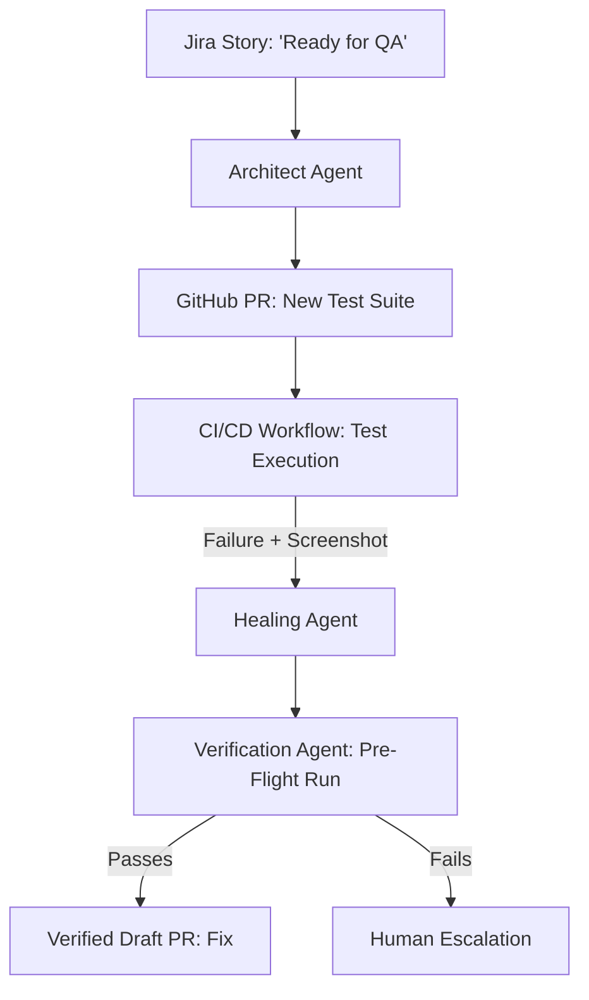

# 🚀 SpecsAI (SyncFlow)
### The World's First Autonomous Zero-Touch SDLC & Self-Healing QA Engine.

**SpecsAI** (SyncFlow) is an advanced AI-driven platform that bridges the gap between Product Requirements and Production-Ready Code. It transforms the traditionally manual SDLC into a fully autonomous, self-correcting loop using **Google Gemini 2.5 Flash** and the **Model Context Protocol (MCP)**.

---

## 🌟 Key Pillars

### 1. 🤖 Autonomous SDLC Sync
*   **Jira Webhooks**: Automatically listen for "Ready for QA" status and generate specs.
*   **GitHub Committer**: Autonomously branch, commit, and open PRs for generated test suites.
*   **TestRail Integration**: Automatically initialize manual test logs for compliance.

### 2. 🛡️ CI/CD Self-Healing Core
*   **Visual Multi-Modal Diagnosis**: Unlike standard log-based healing, SpecsAI uses **Vision AI** to analyze failure screenshots. It "sees" UI discrepancies, overlapping elements, and layout shifts to provide high-fidelity patches.
*   **Secure PR Pattern (HITL)**: Enterprise-safe architecture. The AI never pushes directly to production branches. Instead, it creates a dedicated fix branch and opens a **Verified Draft Pull Request** with a full root-cause analysis for human review.
*   **Pre-Flight Verification**: Every autonomous fix is automatically re-validated in the CI container. A PR is only generated if the test passes after the AI's patch.

### 3. 🔌 MCP Intelligence
*   **IDE Integration**: A standalone MCP server that brings Staff-level QA intelligence directly into your local IDE (Cursor/VS Code).
*   **Local Execution**: Run, debug, and heal tests locally before they ever reach the cloud.

---

## 🛠️ Technology Stack
*   **Core**: Next.js 15, TypeScript, TailwindCSS
*   **AI Engine**: Google Gemini 2.5 Flash
*   **Protocols**: Model Context Protocol (MCP)
*   **Integrations**: GitHub Octokit, Jira REST API, Playwright, Selenium

---

## 🚀 Quick Start

### 1. Configure Environment
Create a `.env.local` file in the root directory:
```bash
# AI Configuration
GOOGLE_GENERATIVE_AI_API_KEY=your_gemini_api_key
SPECS_ACCESS_CODE=DemoSpecs2026

# GitHub Configuration (PAT with 'repo' scope)
GITHUB_TOKEN=ghp_your_personal_access_token
GITHUB_OWNER=your_github_username
GITHUB_REPO=your_repository_name

# Jira Configuration
JIRA_DOMAIN=your-domain.atlassian.net
JIRA_USER_EMAIL=your-email@example.com
JIRA_API_TOKEN=your_jira_api_token
```

### 2. Verify Connectivity
Run the diagnostic script to ensure all external integrations (Gemini, GitHub, Jira) are correctly authenticated:
```bash
node --env-file=.env.local scripts/verify-env.js
```

### 3. Setup Jira Webhook
To enable autonomous spec generation, connect Jira to your local/deployed app:
1.  **Start a Tunnel** (if running locally): `npx localtunnel --port 3000`
2.  **Go to Jira**: System Settings -> Webhooks.
3.  **Create Webhook**: 
    *   **URL**: `https://<your-tunnel-url>/api/webhooks/jira`
    *   **Events**: Check `Issue: updated`.
    *   **JQL**: `project = "YOUR_PROJECT_KEY" AND status = "Ready for QA"`

### 4. Run Locally
```bash
npm install
npm run dev
```

### 5. Start MCP Server
```bash
npx tsx mcp-server.ts
```

---

## 📐 Architecture & Workflow
SpecsAI operates on a "Living Blueprint" philosophy, ensuring that code is always a direct, validated reflection of requirements.

1.  **Requirement Sync**: A Jira Story is moved to "Ready for QA".
2.  **Autonomous Spec Gen**: The **Architect Agent** reads the requirement, generates Gherkin scenarios and Playwright test code.
3.  **GitHub Automation**: A new branch is created, and a Draft PR is opened with the new tests.
4.  **Self-Healing CI**: If a test fails in CI, the **Staff QA Agent** analyzes logs + screenshots and pushes a verified fix.


